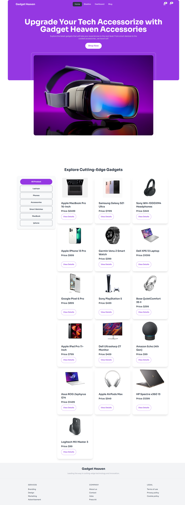
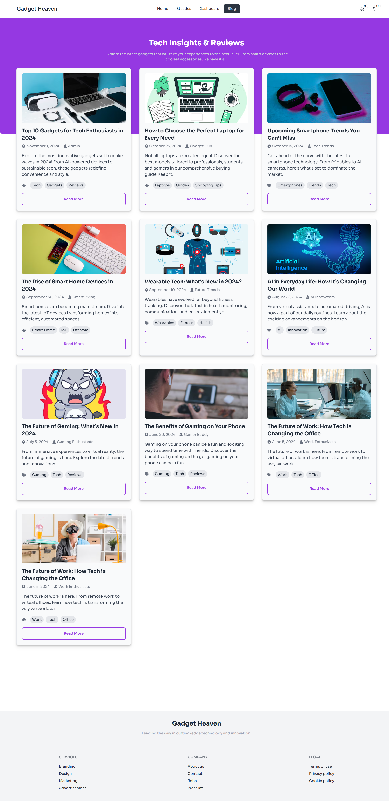
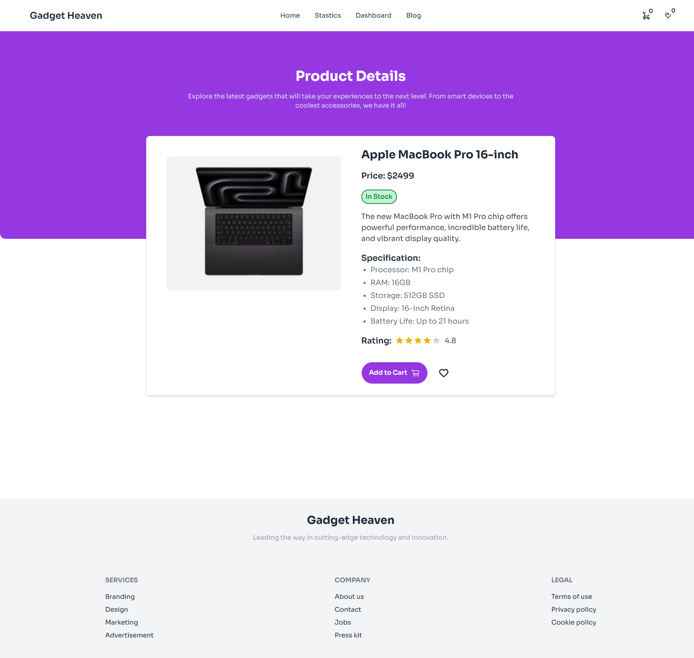

# Gadget Heaven

A website for gadget lovers. This website is built using ReactJS, React Router, Tailwind CSS , Daisy UI, React Icons and Netlify.

## Live Website Link
[https://jh-gadget.netlify.app/](https://jh-gadget.netlify.app/)

## Requirement Document Link
[https://github.com/ProgrammingHero1/B10-A8-gadget-heaven/blob/main/Batch-10_Assignment-08-.pdf](https://github.com/ProgrammingHero1/B10-A8-gadget-heaven/blob/main/Batch-10_Assignment-08-.pdf)

## List of React Fundamental concepts used in the project
- Components
- Props
- State
- JSX
- Event Handling
- Conditional Rendering
- List and Keys
- React Hooks (useState, useEffect, useContext)
- React Router
- React Context
- .some used which return boolean value

## For handling and managing data
- Using Context API

## 5 features of your website/project
- A user can add products to cart
- A user can add products to wishlist
- A user can view the products in the cart and wishlist
- A user can remove products from the cart and wishlist
- A user can view the details of a product

## Screenshots
- Home Page: 
- Blog Page: 
- Product Details Page: 
